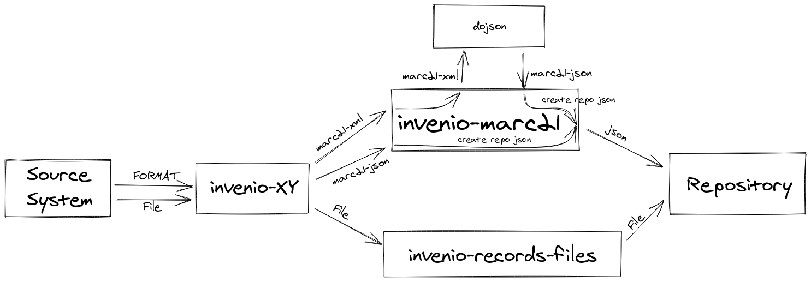

..
    This file is part of Invenio.
    Copyright (C) 2016-2018 CERN.
    Copyright (C) 2020 Graz University of Technology.

    Invenio is free software; you can redistribute it and/or modify it
    under the terms of the MIT License; see LICENSE file for more details.

================
 Invenio-MARC21
================

.. image:: https://img.shields.io/github/license/tu-graz-library/invenio-marc21.svg
        :target: https://github.com/tu-graz-library/invenio-marc21/blob/master/LICENSE

.. image:: https://github.com/tu-graz-library/invenio-marc21/workflows/CI/badge.svg
        :target: https://github.com/tu-graz-library/invenio-marc21/actions

.. image:: https://img.shields.io/coveralls/tu-graz-library/invenio-marc21.svg
        :target: https://coveralls.io/r/tu-graz-library/invenio-marc21

.. image:: https://img.shields.io/pypi/v/invenio-marc21.svg
        :target: https://pypi.org/pypi/invenio-marc21

Invenio module with nice defaults for MARC21 overlay.

*This is an experimental developer preview release.*

Usage
------------

This module could be used to store marc21 metadata into the repository.

The usage should be like the following picture:

The module invenio-XY could be invenio-rdm-pure, invenio-records-lom,
invenio-cms, invenio-alma etc.

The json then stored into the repository would look like the following::

    {
      "$schema": "https://localhost/schemas/records/marc21-v1.0.0.json",
      "id": "abcde-12345",
      "conceptid": "12345-abcde",
      "pid": {
        "pk": 1,
        "status": "R"
      },
      "conceptpid": {
        "pk": 2,
        "status": "R"
      },
      "pids": {
        "doi": {
          "identifier": "10.5281/zenodo.1234",
          "provider": "datacite",
          "client": "zenodo"
        }
      },
      "metadata": {
        "control_number_identifier": "AT-OBV",
        "date_and_time_of_latest_transaction": "20170703041800.0",
        "physical_description_fixed_field_general_information": "cr#|||||||||||",
        "fixed_length_data_elements": "100504|1932####au######o#####|||#|#ger#u",
        "cataloging_source": {
          "modifying_agency": [
            "TUW"
          ],
          "original_cataloging_agency": "TUG",
          "language_of_cataloging": "ger",
          "description_conventions": [
            "rakwb"
          ]
        },
        "language_code": [{
          "language_code_of_text_sound_track_or_separate_title": [
            "ger"
          ],
          "translation_indication": "No information provided",
          "source_of_code": "MARC language code"
        }],
        "country_of_publishing_producing_entity_code": {
          "iso_country_code": ["XA-AT"]
        },
        "title_statement": {
          "statement_of_responsibility": "hrsg. von Josef Frank",
          "title": "<<Die>> Internationale Werkbundsiedlung Wien 1932",
          "title_added_entry": "No added entry"
        }
      },
      "provenance": {
        "created_by": {
          "user": 1
        },
        "on_behalf_of": {
          "user": 2
        }
      },
      "access": {
        "owned_by": [{
          "user": 1
        }],
        "embargo_date": "2021-01-01T00:00:00+0000",
        "access_condition": {
          "condition": "Medical doctors.",
          "default_link_validity": 30
        }
      },
      "files": {},
      "notes": [
        "Under investigation for copyright infringement."
      ]
    }

The idea behind this is to be compliant with the invenio-rdm-records datamodel.
This provides us the possibility to use the invenio-records-resources module to
upload files. Therefore this module has not to create/provide a api to upload
files.

* Free software: MIT license
* Documentation: https://invenio-marc21.readthedocs.io/
